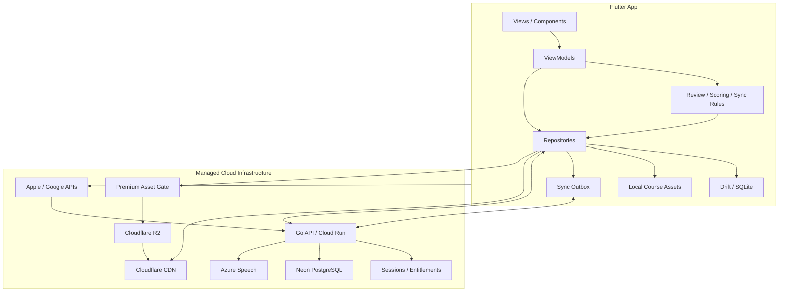

# Mandarin Mission 开发方案

> 文档版本：v0.2
> 日期：2026-07-18
> 状态：开发基线，可用于建立仓库、拆分任务和启动可玩原型  
> 适用范围：英语使用者学习简体普通话的一期产品

## 1. 方案结论

Mandarin Mission 采用“移动端本地优先 + 自研单体 API + 托管云基础设施 + 数据驱动课程”的实现路线。

首个交付目标不是完整课程库，而是一个能验证核心闭环的可玩原型：用户在城市地图中进入地点，完成短课，获得理解/记忆/开口三颗能力星，第二天收到按薄弱维度安排的复习，最后在没有全文提示的情况下完成预设场景对话。

开发顺序固定为：

1. 先完成一个地点的一节课端到端垂直切片；
2. 再补齐四锚复习与单人游戏循环；
3. 扩展到 3 个地点、12 节课开展封闭测试；
4. 指标达标后才扩到 6 个地点、约 30 节公开 MVP；
5. 受控 AI 对话和精细声调反馈不阻塞首发。

## 2. 目标与非目标

### 2.1 产品目标

- 用户每天用 5—15 分钟完成一节新课、一次到期复习和一次开口任务。
- 用户在完成一个地点后，能够听懂并说出该场景的核心表达。
- 学习记录区分意义、声音/声调、汉字和场景四个掌握维度。
- 课程、复习题、星级和地图进度尽量由同一份内容元数据生成。
- App 在弱网或短时离线时仍可完成已下载课程与复习，联网后再同步。

### 2.2 工程目标

- 一套移动端代码覆盖 Android 和 iOS，首轮测试优先 Android。
- 一人可以独立开发、发布、排障和持续制作课程。
- 所有业务服务由项目维护，运行在托管容器上；不管理虚拟机或 Kubernetes。
- 基础设施密钥与商店服务端凭据不得进入客户端；身份、票据和通知校验必须有拒绝与幂等测试。
- 内容格式可校验、可版本化、可回滚；错误课程包不能进入正式构建。
- 核心学习算法可用单元测试验证，不依赖 UI 或云服务。

### 2.3 一期非目标

- 不做排行榜、好友、组队、公会、实时 PK 或用户生成内容。
- 不做金币经济、抽卡、装备、复杂商城或高维护活动系统。
- 不做完整 HSK、儿童课程、繁体字、粤语或多界面语言。
- 不做开放式 AI 外教、真人教师市场和高阶作文批改。
- 不建设独立运营后台；首期使用受版本控制的内容文件和校验脚本。

## 3. 交付分层

| 阶段 | 范围 | 可交付结果 | 放行条件 |
|---|---|---|---|
| 垂直切片 | 1 个地点、1 节完整课 | 从地图进入课程、完成练习、保存进度、触发复习 | 重启后进度不丢失，课程内容通过 Schema 校验 |
| 可玩原型 | 3 个地点、12 节课 | 地图、三星、每日任务、连胜、印章、四锚复习、终局挑战 | 30—50 名测试者可独立完成首周学习 |
| 公开 MVP | 6 个地点、约 30 节课 | 账号同步、订阅、基础语音、分析、崩溃监控、商店发布 | 核心指标达到第 15 节定义的 Go 线 |
| 一期完整版 | 10 个地点 | 受控 AI 对话、细化发音反馈、更多课程内容 | MVP 留存、学习效果和付费模型已验证 |

## 4. 技术选型

### 4.1 客户端

| 项目 | 选择 | 说明 |
|---|---|---|
| 跨端框架 | Flutter / Dart | 一套代码覆盖 Android 和 iOS，适合统一实现动画、音频、地图和练习组件 |
| UI 系统 | `shadcn_ui` 0.55.0 + 语义主题/布局令牌 | 代码优先组合稳定组件；官方 shadcn/ui 用作基础语义参考，awesome-shadcn-ui 用作扩展模式发现目录，Material 保留平台外壳 |
| 架构 | 功能优先目录 + MVVM | View 只负责呈现；ViewModel 处理页面状态；Repository 统一本地与远端数据 |
| 状态管理 | Riverpod | 依赖显式、易测试；避免引入第二套状态管理方案 |
| 导航 | go_router | 支持引导、主导航、课程深链与登录回跳 |
| 本地数据库 | Drift + SQLite | 结构化保存进度、复习队列、内容索引和同步 Outbox；支持查询与迁移 |
| 音频 | Flutter 音频播放/录音插件，封装为接口 | 业务层不直接依赖具体插件，便于处理平台差异和后续替换 |
| 本地设置 | SharedPreferences 仅保存轻量配置 | 学习进度不得只放键值存储 |

Flutter 官方架构指南建议分离 View、ViewModel、Repository 和 Service，本方案沿用这套边界，但不额外引入复杂领域层，只有复习调度、课程判分和同步冲突等核心规则放入纯 Dart domain 模块。[Flutter App Architecture](https://docs.flutter.dev/app-architecture/guide)

前端按 `docs/design-system.md` 和 `docs/development-workflow.md` 直接从组件库进入代码。基础组件先查官方 shadcn/ui，需要更多模式时可从 `awesome-shadcn-ui` 返回原始来源；外部候选单独核验许可证，并用现有 Flutter 组件和项目令牌实现，不复制 React/Tailwind 代码或引入第二套完整 UI 框架。Figma 仅在品牌素材、复杂交互或高风险方向比较时按需使用，不作为标准页面开始实现的门槛。

### 4.2 云服务

| 能力 | 选择 | 使用边界 |
|---|---|---|
| 业务 API | Go 单体服务 + Google Cloud Run | 自研账号会话、批量同步、内容 Manifest、订阅权益、语音代理和事件采集；容器空闲缩到 0，不使用虚拟机或 Kubernetes |
| 登录与用户 | API 自研会话层 | 原型允许匿名使用；同步或购买时交换 Apple/Google 身份令牌，服务端签发短时访问令牌并保存刷新令牌哈希 |
| 云数据库 | Neon PostgreSQL | 保存用户档案、进度事件、同步游标、权益、内容版本和远端配置；App 不得直连 |
| 文件存储 | Cloudflare R2（S3 兼容） | 保存可下载课程包、音频和插画；数据库只保存对象元数据 |
| 全球 CDN | R2 自定义域名 + Cloudflare CDN | App 直接下载版本化资源；免费资源公开缓存，付费资源在 MVP 前增加短时令牌门禁 |
| 订阅 | API 自研权益模块 | 对接 App Store/Google Play 票据验证和服务端通知；通知幂等落库，本地只缓存最近权益状态 |
| 发音评测 | Azure Speech，置于 Provider 接口后 | 只评测已知目标文本；密钥仅在服务端；可通过 Feature Flag 关闭 |
| 分析 | API 批量事件入口 | 只接收产品事件和非敏感分群，不上传录音或用户自由文本；原型可先只保存在设备端 |
| 崩溃 | Cloud Run 日志 + 后续最小移动端崩溃入口 | 服务端使用结构化日志；移动端在 MVP 前只实现定位发布问题所需的最小采集 |

Cloud Run 按实际使用计费并可在无流量时缩到 0；Neon 提供托管 PostgreSQL 的免费/用量层；R2 提供 S3 兼容对象存储、免费公网出口和通过自定义域名启用 Cloudflare Cache 的能力。[Cloud Run pricing](https://cloud.google.com/run/pricing) [Cloud Run autoscaling](https://docs.cloud.google.com/run/docs/about-instance-autoscaling) [Neon pricing](https://neon.com/pricing) [R2 pricing](https://developers.cloudflare.com/r2/pricing/) [R2 custom domains](https://developers.cloudflare.com/r2/buckets/public-buckets/)

Azure Speech 当前支持 `zh-CN` 脚本式发音评测，可返回准确度、流利度及词级结果；产品仍应把分数视为辅助反馈，不能用一次自动评测判定用户“完全错误”。[Azure Speech 语言支持](https://learn.microsoft.com/en-us/azure/ai-services/speech-service/language-support?tabs=pronunciation-assessment) [发音评测说明](https://learn.microsoft.com/en-us/azure/ai-services/Speech-Service/how-to-pronunciation-assessment)

### 4.3 为什么使用一个自研容器，而不是虚拟机或微服务

业务服务自己写，可以避免 Supabase 与 RevenueCat 的组合固定成本并掌握数据模型；计算、数据库和对象存储仍交给托管基础设施，避免维护操作系统、补丁、备份集群和 Kubernetes。首版只部署一个 Go 单体容器：它足以容纳账号、同步、权益和供应商代理，也便于统一鉴权、事务和排障。只有某个模块出现可验证的独立扩缩容、权限隔离或发布节奏需求时才拆分。

完整决策、成本假设和护栏见 [ADR 0001](decisions/0001-managed-container-backend.md)。

## 5. 总体架构



### 5.1 数据原则

1. 本地数据库是设备端学习体验的即时事实来源。
2. 云端保存可跨设备合并的进度，而不是每次点击都阻塞等待网络。
3. 所有写操作先落本地事务，再写入 Outbox；同步成功后标记已确认。
4. 课程内容不可被用户进度修改，通过独立的内容版本号发布。
5. 订阅权限以 API 权益记录为准，本地只缓存最近状态；Apple/Google 通知必须幂等处理。
6. Flutter App 只访问 API 和 CDN，不直接连接 PostgreSQL 或持有 R2 凭据。
7. API 只返回 JSON、元数据和短时令牌；课程音频、图片和课程包不经过 Cloud Run。

## 6. 当前仓库结构

```text
.
├─ AGENTS.md                     # 项目级 Agent 规则与知识路由
├─ HANDOFF.md                    # 唯一实时交接状态
├─ README.md
├─ .agents/skills/               # 可复用的项目级 Codex 工作流
├─ .codex/
│  ├─ config.toml
│  └─ hooks/                     # 工具执行前的机械护栏
├─ tools/
│  └─ scripts/                   # 确定性验证脚本
├─ docs/
│  ├─ AGENTS.md                  # 文档区域局部规则
│  ├─ architecture.md            # 稳定产品与架构基线
│  ├─ 开发方案.md
│  ├─ content-authoring.md
│  ├─ decisions/
│  └─ runbooks/
├─ apps/
│  └─ mobile/
│     ├─ AGENTS.md               # Flutter/UI/媒体局部规则
│     ├─ android/
│     ├─ ios/
│     ├─ lib/
│     │  ├─ app/                 # 启动、路由、主题、全局依赖
│     │  ├─ core/                # 主题、错误、时间、日志、通用类型
│     │  ├─ domain/              # 复习、判分、同步等纯 Dart 规则
│     │  ├─ data/                # 数据库、远端服务、Repository 实现
│     │  ├─ features/
│     │  │  ├─ onboarding/
│     │  │  ├─ journey/
│     │  │  ├─ lesson/
│     │  │  ├─ review/
│     │  │  ├─ speaking/
│     │  │  ├─ quests/
│     │  │  ├─ progress/
│     │  │  └─ paywall/
│     │  └─ shared/              # 重复出现的项目级 UI 组合，不复制组件库原语
│     └─ test/
├─ content/
│  ├─ AGENTS.md                  # 内容、资产与许可局部规则
│  ├─ schema/
│  └─ fixtures/
├─ packages/
│  └─ learning_core/             # 纯 Dart 规则、内容校验与局部规则
├─ services/
│  └─ api/                       # Go 单体 API、数据库迁移和服务端适配器
│     ├─ AGENTS.md               # API 与云边界局部规则
│     ├─ cmd/api/
│     └─ internal/
├─ infra/                        # 真正开始部署后再加入的基础设施声明
└─ .github/workflows/
```

根 `AGENTS.md` 保持短、准、稳定；细节按 `docs/`、项目 Skills、Hooks、确定性脚本与局部 `AGENTS.md` 分层。第一阶段不建立 monorepo 管理框架；普通目录和脚本足够。只有共享包数量明显增加时再引入额外工作区工具。

## 7. 核心领域模型

### 7.1 内容模型

| 实体 | 核心字段 | 说明 |
|---|---|---|
| `CourseManifest` | `version`, `minAppVersion`, `locations`, `assetBaseUrl` | 一次可发布和回滚的课程集合 |
| `Location` | `id`, `title`, `order`, `unlockRule`, `lessonIds`, `challengeId` | 地图中的地点 |
| `Lesson` | `id`, `locationId`, `duration`, `prerequisites`, `steps` | 8—12 分钟课程 |
| `KnowledgeItem` | `id`, `kind`, `hanzi`, `pinyin`, `pinyinSyllables`, `english`, `audio`, `tags` | 词、短语、句型或汉字；逐字音节用于稳定对齐汉字与拼音，标点独立渲染 |
| `Exercise` | `id`, `dimension`, `type`, `prompt`, `answers`, `scoring` | 可复用练习定义 |
| `Dialogue` | `id`, `nodes`, `allowedItemIds`, `completionRule` | 预设分支微对话 |
| `Asset` | `id`, `path`, `sha256`, `license`, `credit` | 音频、插画及其来源记录 |

内容必须使用稳定 ID。显示文案、排序或资源路径变化不能改变 ID，否则会切断已有用户进度。

### 7.2 用户学习模型

| 实体 | 核心字段 | 说明 |
|---|---|---|
| `UserProfile` | `userId`, `interfaceLanguage`, `dailyGoal`, `motivation` | 用户偏好与目标 |
| `LessonProgress` | `lessonId`, `status`, `score`, `completedAt`, `contentVersion` | 课程完成状态 |
| `MasteryState` | `itemId`, `dimension`, `box`, `confidence`, `dueAt`, `lastResult` | 四个维度分别保存 |
| `ReviewAttempt` | `attemptId`, `itemId`, `dimension`, `result`, `latencyMs`, `createdAt` | 复习调度输入和审计记录 |
| `SpeakingAttempt` | `attemptId`, `targetId`, `localScore`, `providerScore`, `createdAt` | 默认不保存原始录音 |
| `QuestProgress` | `date`, `newLessonDone`, `reviewDone`, `speakingDone` | 每日三任务 |
| `StreakState` | `current`, `longest`, `lastActiveDate`, `freezeBalance` | 按用户时区计算 |
| `LocationProgress` | `locationId`, `stars`, `stampEarned`, `challengePassed` | 地图与印章状态 |
| `SyncOutbox` | `eventId`, `entityType`, `payload`, `occurredAt`, `attempts` | 离线写入待同步队列 |

### 7.3 掌握度维度

内部枚举固定为：

- `meaning`：从概念或英语提示理解中文表达；
- `listening`：只听音频时识别表达；
- `tone`：模仿目标发音与声调；
- `hanzi`：识认汉字、连接读音与意义，并通过简单临摹和脱稿书写巩固字形；
- `context`：只用于场景挑战的综合结果，不进入常规四锚复习队列。

## 8. 课程内容格式与生产流程

### 8.1 内容包最小示例

```json
{
  "schemaVersion": 1,
  "id": "cafe-01",
  "locationId": "cafe",
  "title": "Order one coffee",
  "estimatedMinutes": 9,
  "items": ["phrase-wo-yao", "noun-kafei"],
  "steps": [
    {
      "id": "cafe-01-intro",
      "type": "scene_intro",
      "assetId": "img-cafe-counter",
      "text": "You are ordering at a café."
    },
    {
      "id": "cafe-01-listen-01",
      "type": "listen_choice",
      "dimension": "listening",
      "itemId": "phrase-wo-yao"
    },
    {
      "id": "cafe-01-speak-01",
      "type": "repeat",
      "dimension": "tone",
      "itemId": "phrase-wo-yao"
    }
  ]
}
```

### 8.2 内容流水线

1. 在模板表格中编写知识点、英文解释、拼音、目标句和练习标签。
2. 导出为 CSV/JSON，通过脚本转成规范内容包。
3. 校验 JSON Schema、ID 唯一性、前置课程、分支可达性和资源引用。
4. 校验音频采样、时长、响度和资源哈希；记录授权来源。TTS 文件技术可用不等于最终音色通过，开发占位、发布候选和已审核资产必须明确区分。
5. 用内部预览页逐课检查图片、文字、音频和答案；普通话审核单独确认声调、变调、停顿与自然度。后续可替换为更自然的商用 TTS，但必须先核验商业发布权、声线授权、数据条款、价格与限额，并在替换后更新哈希、许可、署名和试听结果。
6. 生成带版本号的 Manifest，并在测试环境发布。
7. 文本至少经过独立英文编辑 Agent、中文教学 Agent 双审及主 Agent 集成，实际普通话录音逐条试听通过后，才能进入正式内容包。

### 8.3 内容校验必须阻止的问题

- 汉字、拼音、逐字音节或音频缺失，逐字音节与汉字数量不一致，或 ID 重复；
- 练习引用不存在的知识点；
- 对话分支没有结束节点或存在不可达节点；
- 课程使用尚未学习的 P0 词句且没有明确引入步骤；
- 免费场景引用付费资源导致离线失败；
- 图片或音频没有来源、授权或内部制作标记；
- 内容版本降低或 `minAppVersion` 不兼容。

## 9. 学习与复习算法 v1

首版不实现难以解释的机器学习模型，使用可测试的分箱调度。每个知识点的 `meaning`、`listening`、`tone` 和 `hanzi` 分别维护一个 0—5 的记忆箱。

### 9.1 初始计划

| 箱位 | 下次复习 |
|---:|---:|
| 0 | 10 分钟后 |
| 1 | 1 天后 |
| 2 | 3 天后 |
| 3 | 7 天后 |
| 4 | 14 天后 |
| 5 | 30 天后 |

### 9.2 更新规则

- 错误或用户选择“忘记”：箱位减 2，最低为 0；本次任务尾部再出现一次。
- 正确但用户选择“模糊”：箱位不变；次日复习。
- 正确且在预期时间内选择“记得”：箱位加 1，最高为 5。
- 使用明显提示后答对：最多维持箱位，不升级。
- `tone` 维度首次仅依据完成录音、目标词命中和用户自评；精细评分上线后再作为辅助信号。
- 同一天同一知识点最多安排两次补救，避免复习队列滚雪球。

调度时间用 UTC 保存，按用户当前时区计算“学习日”。时区变化只影响未来每日任务，不重写历史完成日期。

### 9.3 复习队列优先级

1. 逾期且最近失败的项目；
2. 与今日新课相关的薄弱项目；
3. 即将到期的 `listening` 和 `tone`；
4. 其他到期项目。

单次复习默认控制在 3—5 分钟。到期项目过多时，分成“今日必做”和“额外巩固”，不向用户展示无法完成的巨大数字。

## 10. 课程播放器与判分

### 10.1 支持的首批步骤类型

- `scene_intro`：20 秒内建立任务目标；
- `teach_card`：场景图、经审核的课程音频、汉字、拼音和英文解释；
- `hanzi_trace`：字模临摹、隐藏字模默写和对照自评，不做高精度机器评分；
- `image_choice`：意义识别；
- `listen_choice`：听音识别；
- `tone_contrast`：声调对比；
- `order_tokens`：短句排序；
- `repeat`：录音、回放和目标文本评测；
- `dialogue_turn`：在预设分支中选择或说出回应；
- `summary`：展示三颗星、薄弱项和下次复习。

### 10.2 判分原则

- 课程完成与高分分开：允许用户完成，但准确记录提示、重试和薄弱项。
- 网络或语音服务失败时提供本地回放与自评，不阻断课程。
- 同一题连续失败两次后给出分步提示，不用无限扣分制造挫败。
- 三星分别计算：理解星来自意义/听音练习，记忆星来自延迟主动回忆，开口星来自口语或终局挑战。
- 首次课程不能直接获得“记忆星”；至少一次跨学习日成功回忆后授予。

## 11. 语音实现

### 11.1 首版分层

1. **P0 本地能力**：真人原音播放、用户录音、回放、重试、录音时长和音量检查。
2. **P0.5 目标词命中**：上传短音频到服务端代理，识别是否包含目标词句；失败时不判整课失败。
3. **P1 发音评测**：对已知参考文本做脚本式评测，展示词级准确度和整体流利度。
4. **后续声调反馈**：只有经过目标用户和教师人工对照验证后，才展示更细的声调建议。

### 11.2 隐私与成本

- App 首次录音前展示用途并请求麦克风权限。
- 默认只在本地保留当前回放需要的临时文件，课程完成或用户重录后删除单个明确文件。
- 服务端完成评测后不长期保存原始录音；日志不得包含音频、完整转写或云服务密钥。
- 音频大小、时长、格式和调用频率在服务端限制；匿名用户使用独立配额。
- Provider 超时、限流或低置信度统一降级到“回听并自评”。

## 12. 游戏化实现

### 12.1 数据驱动规则

- 地图解锁来自 `Location.unlockRule`，不为每个地点写专用代码。
- 每日三任务固定为新课、复习和开口，课程元数据决定具体任务。
- 连胜只在三任务中任意两项完成后计一天，避免只打开 App 刷连胜。
- 每连续 7 天最多获得 1 张休息券；首版最多持有 2 张。
- 地点印章在终局挑战通过后授予，不通过购买或重复点击获得。
- 连击只影响动画、音效和即时反馈，不进入货币经济。

### 12.2 防止游戏压过学习

- 所有动画必须可跳过，低性能设备可关闭复杂效果。
- 奖励页面不超过一次点击即可返回主路径。
- 不使用无限红点、惩罚性倒计时或付费恢复连胜。
- 指标同时观察学习效果与游戏行为；连胜升高但 7 日回忆率下降时，优先调整学习循环。

## 13. 云端表与同步

### 13.1 最小云端表

- `profiles`：用户偏好和时区；
- `devices`：同步设备和最后活动时间；
- `progress_events`：不可变学习事件，按 `event_id` 幂等写入；
- `progress_snapshots`：服务端聚合后的设备无关快照；
- `content_releases`：课程 Manifest、状态和发布时间；
- `speech_usage`：只保存计费和限流字段，不保存音频；
- `auth_sessions`：刷新令牌哈希、设备和失效时间；
- `entitlements`：当前商店权益及有效期；
- `entitlement_audit`：商店服务端通知的幂等处理结果。

数据库只允许 Go API 和受控迁移任务连接，Flutter App 不持有连接串。每个用户请求从已验证会话确定 `user_id`，Repository 查询必须显式包含用户边界，并测试伪造、跨用户读取和跨用户写入均被拒绝。管理操作只允许单独的服务端角色执行，凭据不得进入 App 或仓库。

### 13.2 同步冲突规则

- 学习尝试按 UUID 去重并追加，不覆盖另一设备的历史事件。
- 掌握箱位以事件重放后的结果为准；无法重放时采用 `updatedAt` 较新的状态，但不得降低已获得的地点印章。
- 连胜按用户学习日和有效任务重算，不直接相加设备上的 streak 数字。
- 设置项使用最后写入胜出；订阅权限始终以服务端权益表与最新商店通知为准。
- 内容版本差异不阻止上传学习事件，事件必须带 `contentVersion` 便于迁移。

## 14. 分析事件与质量监控

### 14.1 关键事件

| 事件 | 必要参数 | 用途 |
|---|---|---|
| `onboarding_completed` | `motivation`, `daily_goal` | 激活漏斗 |
| `lesson_started` | `lesson_id`, `location_id`, `content_version` | 课程进入率 |
| `lesson_completed` | `duration`, `attempts`, `stars` | 完成率和难度 |
| `review_completed` | `due_count`, `completed_count`, `accuracy` | 复习压力 |
| `speaking_attempted` | `target_id`, `result`, `fallback_used` | 语音可靠性 |
| `challenge_completed` | `challenge_id`, `prompt_level`, `passed` | 场景输出能力 |
| `daily_quests_completed` | `quest_count`, `streak_day` | 游戏循环 |
| `paywall_viewed` | `source`, `offering` | 付费漏斗 |
| `purchase_completed` | `product_id`, `source` | 购买转化 |

不得发送录音、识别全文、自由文本、邮箱、姓名或原始用户 ID 到分析事件。使用随机分析 ID，并提供隐私说明和适用地区所需的选择机制。

### 14.2 质量门槛

- Crash-free users 达到发布要求后才扩大流量；
- 语音超时率、低置信度率和降级率独立监控；
- 内容错误必须能定位到 `contentVersion + lessonId + stepId`；
- 自研崩溃入口上线前要完成一次可控 Dart 异常，确认版本、设备环境和脱敏堆栈可读；原始录音、Token 与用户自由文本不得进入报告。

## 15. 指标与 Go/No-Go

北极星指标：**每周完成至少 3 次“新课 + 复习 + 开口任务”的有效学习用户数。**

| 类型 | 指标 | 原型/MVP 验证线 |
|---|---|---:|
| 激活 | 完成首课并成功说出第一句中文 | ≥60% |
| 留存 | D1 / D7 留存 | ≥35% / ≥15% |
| 学习效果 | 7 天后核心词句主动回忆正确率 | ≥70% |
| 输出 | 场景结束后完成无全文提示微对话 | ≥50% |
| 游戏循环 | D7 用户每周至少 3 次完成每日任务 | ≥40% |
| 游戏质量 | 获得记忆星/开口星的用户占获得任意星用户 | ≥50% |
| 语音体验 | 识别误判导致的退出率 | <5% |
| 商业 | 看到付费页后的购买转化 | 初始验证线 ≥3% |

如果 D7 未达标，不新增课程数量，先检查首课长度、复习压力、语音误判和奖励节奏。如果回忆率未达标，优先修复课程与调度，不用更强游戏奖励掩盖问题。

## 16. 开发计划

### 阶段 0：仓库和决策基线（第 1 周）

- 建立 Flutter 工程、目录边界、代码规范和 GitHub Actions。
- 建立代码优先 UI 决策、shadcn 主题和组件使用规范。
- 建立内容 Schema、示例内容和校验命令。
- 建立 Go 单体 API 容器、健康检查和容器构建 CI。
- 建立架构决策记录，确认首发平台、包名、产品名和隐私主体。
- 完成 Definition of Done、Issue 模板和 Bug 模板。

验收：全新环境按 README 可运行空壳 App；PR 自动执行格式、静态检查、单元测试和内容校验。

### 阶段 0.5：代码优先 UI 基线（已完成）

- 引入并精确锁定 `shadcn_ui`，以 `ShadApp.custom` 与 Material/go_router 共存。
- 用语义令牌统一颜色、圆角、字体和反馈状态。
- 迁移 Journey 与数据驱动课程播放器，按步骤拆分 presentation 组件；当前咖啡课程为 11 步。
- 把课程持久化、提交中和错误处理从 Widget 回调收敛到 Controller。

验收：现有移动端主路径行为不变，静态分析和全量 Widget/Repository/迁移测试通过；APK 构建与真实设备截图在本分支交付前验证。

### 阶段 1：点咖啡垂直切片（第 2—6 周）

- 完成 Journey 地图最小页、课程播放器和 6—8 种步骤组件。
- 建立 Drift 数据库、Repository 和迁移测试。
- 完成一节“点咖啡”课程、许可清晰且通过普通话人工审核的课程音频和基础插画。
- 保存课程结果，生成四维掌握状态和到期复习。
- 完成本地到期复习 UI，覆盖忘记/模糊/记得与四维题型。
- 完成本地录音、回放和离线降级。

验收：在飞行模式下可完成已下载课程；杀掉 App 后进度存在；第二天复习队列正确；无云服务也不阻断核心课程。

### 阶段 2：可玩循环（第 7—10 周）

- 按 [M2 课程蓝图](requirements/m2-curriculum.md) 扩展到 3 个地点、12 节课和 3 个地点终局；M2 `0.2.7` 保留双专业 Agent 已审核并 language lock 的文本，49 条普通话音频已完成用户试听、唯一选择、App asset 接入、APK 资源核对和 Sony 逐条技术播放；通用 `dialogue_turn` 多轮播放器、线性解锁、终局完成持久化与跨进程恢复已实现。新增范围 14/14 单元已在 Sony 完成人工逐页 UX。2026-07-26 用户批准后，M2 已提升为 `release` 并成为 App 默认加载内容包。
- 完成三星、每日三任务、连胜、休息券、印章和终局挑战。
- 完成内容预览和自动校验脚本。
- 接入匿名分析、崩溃监控和 Feature Flag。
- 用 10—15 名内部体验者修复首轮流程问题。

验收：用户不需要解释即可完成首日路径；所有奖励都能追溯到学习事件；内容包可在不改客户端代码的情况下增加课程。

### 阶段 3：封闭测试（第 11—12 周）

- 招募 30—50 名英语使用者。
- 建立反馈入口、测试者说明、隐私文本和数据看板。
- 只修复激活、崩溃、复习压力、语音挫败和关键内容错误。
- 对自动发音结果抽样做教师人工对照。

验收：能计算第 15 节全部核心指标；高优问题有复现步骤；明确给出继续、调整或停止扩展的结论。

### 阶段 4：公开 MVP（第 13—18 周）

- 扩展到 6 个地点、约 30 节课。
- 增加 API 身份令牌交换、会话、Outbox 批量同步和内容增量发布。
- 接入 Apple/Google 商店票据验证、服务端通知、权益恢复和付费墙。
- 接入语音服务端代理、限流、超时和隐私降级。
- 将公共课程资源发布到 R2 自定义域名和 CDN；为付费资源增加短时令牌门禁。
- 完成无障碍、弱网、低端设备和商店购买测试。

验收：跨设备进度可合并；购买与恢复购买可验证；账号删除能够清除云端个人数据；商店审核材料完整。

### 阶段 5：发布与观察（第 19—24 周）

- Android 分阶段发布，稳定后再提交 iOS。
- 监控崩溃、课程漏斗、语音失败、订阅和内容错误。
- 小流量验证获客，不进行无法承受支持量的大规模推广。
- 达标后规划 10 个地点与受控 AI 对话；未达标则修复核心闭环。

## 17. 测试策略

### 17.1 自动测试

- Domain 单元测试：分箱调度、星级、连胜、休息券、解锁规则、同步合并。
- Repository 测试：本地优先读取、事务写入、Outbox 重试、内容版本迁移。
- Widget 测试：课程步骤状态、提示、重试、无障碍标签和付费锁定。
- Golden 测试：只覆盖视觉已稳定的主要页面，并验证常见手机尺寸和大字体；探索页不制造高维护快照。
- 集成测试：首次启动、完成课程、次日复习、终局挑战、购买与恢复购买。
- 内容测试：Schema、ID、资源、分支、前置知识、拼音格式和 Manifest 哈希。

### 17.2 手工测试矩阵

- Android 低端/主流设备；iPhone 小屏/主流屏；
- 无网、弱网、网络切换、服务超时；
- 麦克风拒绝、录音中断、耳机/蓝牙切换；
- 系统时间和时区变化；
- 升级内容包、回滚内容包、旧进度迁移；
- 匿名转登录、同账号双设备、退出与删除账号；
- 购买成功、取消、退款、过期、恢复购买；
- 英文长文本、200% 字体、屏幕阅读器、减少动态效果。

## 18. CI/CD 与分支策略

- 默认分支：`main`，始终保持可构建。
- 功能分支：`feat/<short-name>`，修复分支：`fix/<short-name>`。
- 提交使用 Conventional Commits，例如 `docs: add development baseline`。
- 每个 PR 必须说明范围、验证方式和是否影响内容 Schema/数据库迁移。
- UI PR 还需附关键状态截图、所用组件、外部候选的原始来源/许可证和已知视觉限制；仅实际使用 Figma 时附节点链接。
- 合并检查：Dart/Go 格式、静态分析、单元/Widget 测试、内容校验、API 容器构建和 Secret 扫描。
- 测试构建通过 GitHub Actions 生成，但签名密钥只放 GitHub Secrets/商店安全环境。
- 发布标签使用 `v0.x.y`；内容包拥有独立 `contentVersion`，不与 App 版本混用。

## 19. 安全、隐私与合规

- 仓库只提交 `.env.example`；真实密钥、本地环境文件、签名文件和服务账号文件必须忽略。
- 客户端只使用 API/CDN 地址和各平台公开配置；PostgreSQL 连接串、R2 密钥、会话签名密钥、Azure 密钥与商店服务端凭据仅在服务端。
- API 从已验证会话提取用户身份，所有用户数据访问都包含 `user_id` 边界，并为跨用户访问编写拒绝测试。
- 刷新令牌只保存哈希；访问令牌短时有效并支持签名密钥轮换。
- 登录前允许本地学习；需要同步或购买恢复时再创建账户，降低收集数据的必要性。
- 提供导出/删除账户路径；删除任务要覆盖 Auth、用户表、对象和第三方用户映射。
- 麦克风、分析和崩溃收集在隐私政策中分别说明；录音不用于模型训练，除非未来单独征得明确同意。
- 不在日志中记录 Token、邮箱、原始录音、完整转写或购买票据。
- 发布前根据目标市场完成 Apple/Google 隐私标签、数据安全表和年龄分级。

## 20. 成本控制

- Cloud Run 保持 `min-instances=0`、`max-instances=3`；没有真实负载证据前不启用常驻实例。
- Neon 使用池化连接和自动休眠，Cloud Run 与数据库选择尽量接近的地区；客户端批量同步，减少跨云往返。
- 原型的 12 节课可随安装包内置；开始增量发布后，音频、插画和课程包直接走 R2 自定义域名与 CDN，不经过 API。
- 资源使用内容哈希文件名和长缓存；临时语音对象设置自动过期规则。
- 音频、插画和课程组件批量生产，同一地点复用场景背景和角色状态。
- 语音调用只发生在明确的开口步骤，设置时长和每日限额；失败可本地降级。
- AI 不进入 P0；后续只做已学词表和当前场景内的受控对话，并限制轮数和 Token。
- 封闭测试目标为每月 US$0—5，早期公开 MVP 目标为每月 US$15—30；该估算不含域名、商店账号和语音费用，详见 ADR 0001。
- 使用托管基础设施免费/低用量层验证，但建立用量告警，不把“当前免费”当作长期架构保证。
- 每月检查容器 CPU/内存、数据库计算与存储、R2 请求、语音分钟数、分析事件量和退款率。

## 21. 主要风险与工程对策

| 风险 | 工程对策 |
|---|---|
| 课程制作慢于代码 | 内容 Schema、预览器、批量音频、可复用模板；先做 12 节高保真内容 |
| 复习队列过重 | 分箱上限、每日必做上限、同日补救次数限制 |
| 语音误判导致流失 | 录音回放、自评降级、低置信度不判错、Provider 可关闭 |
| 云服务影响离线学习 | 本地事务先行、Outbox 同步、课程包缓存 |
| 多设备覆盖进度 | 不可变事件、幂等 ID、服务端重算、不直接相加 streak |
| 游戏系统持续膨胀 | 机制白名单；新机制必须证明提升学习指标且能由元数据驱动 |
| 内容更新破坏旧进度 | 稳定 ID、内容版本、迁移测试、Manifest 回滚 |
| 一人维护供应商过多 | 每个外部服务经单一 Adapter 接入；原型阶段只启用必要服务 |

## 22. 当前里程碑清单

- [x] Flutter 工程、CI、内容 Schema/校验器和 Go 容器基线；
- [x] Drift v1、安装包内内容 Repository 和迁移测试；
- [x] Journey、数据驱动课程步骤、进度/掌握度持久化；
- [x] 复习算法和本地到期队列数据层；
- [x] 代码优先 shadcn UI 基线与现有页面迁移；
- [x] 到期复习 UI 与 Journey 入口；
- [x] 简单汉字临摹、脱稿书写、自评和 `hanzi` 掌握度保存；
- [ ] 经审核的课程音频、本地录音、回放和服务不可用降级；
- [ ] 正式插画/音频资产和内容发布校验；`image_choice`、`tone_contrast`、`order_tokens` 已实现并通过自动测试与 Android 模拟器验收，仍待 11 步课程真机复验；
- [x] 一台真实 Android 设备上的课程 → 重启 → 到期复习闭环。

M1 完成定义：上述剩余项关闭，并在飞行模式下完成已下载的“点咖啡”课程；杀掉 App 后进度存在；正确时间出现到期复习；没有云服务也不阻断核心课程。2026-07-23 Sony `XQ-DQ72` 已通过旧 8 步课程的飞行模式完整课程、杀进程后的完成进度保留和 8 项必做到期复习保存；2026-07-24 三种缺失步骤已进入 11 步 Fixture，并通过自动验证与 Android 模拟器交互/视觉验收，但新课程仍待真机复验。M1 继续受经审核音频与正式资产阻塞。

## 23. 待确认但不阻塞建仓的决策

| 决策 | 当前默认值 | 最晚确认时间 |
|---|---|---|
| 正式产品名 | Mandarin Mission 为代号 | 商店素材制作前 |
| 首发平台 | Android 优先 | Flutter 工程创建前 |
| 包名/Bundle ID | `com.hieronymusf.mandarinmission` | 已于 Flutter 工程创建时确认 |
| GitHub 可见性 | 私有仓库 | 创建远端仓库时 |
| 开源协议 | 暂不授权 | 仓库转公开前 |
| 云服务地区 | 依据首批测试者地区选择，Cloud Run 与 Neon 尽量接近 | 建 Cloud Run/Neon/Azure 项目前 |
| 是否保留录音 | 默认不保留 | 语音功能设计评审前 |
| 订阅测试价格 | US$5.99/月、US$29.99/年 | 商店产品创建前 |

## 24. 完成标准

公开 MVP 可以发布，必须同时满足：

- 6 个地点和约 30 节课全部通过内容、语言和音频审核；
- 用户能在离线状态完成已下载课程并在联网后正确同步；
- 课程、复习、开口、终局挑战和付费恢复均有自动或可重复手工测试；
- 没有客户端 Secret，API 跨用户访问拒绝测试和账号删除经过验证；
- 服务端日志、移动端崩溃、核心分析事件、语音失败率和订阅状态可观测；
- 核心无障碍、弱网、时区、低端设备和商店购买场景通过；
- 封闭测试数据支持继续投入，且没有用新增功能掩盖留存或学习效果问题。

本方案作为一期开发基线。任何新增功能都要说明影响的阶段、需要删除或延后的现有范围、数据模型变化和可验证的成功指标。
