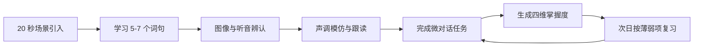

# 英语使用者学中文 App：独立开发者一期方案

> 调研日期：2026-07-15  
> 一期对象：使用英语、从零开始学习普通话的成年人  
> 核心结论：采用“视觉记忆 + 单人闯关 + 场景任务 + 受控口语”，用轻量游戏壳提高留存，但不建设高维护的社交游戏系统。

## 一、先给结论

市场上已经不缺“大而全的语言课程”和“自由聊天的 AI 外教”。更可行的切口是：

**帮助英语使用者每天用 10 分钟，把一个真实中文场景学到“看得懂、听得出、说得出”。**

一期产品以普通话、简体字和零基础成人为边界，不追求覆盖完整 HSK，也不做无限制 AI 聊天。考虑到由一人独立开发，产品只实现可复用的单人游戏机制：地图、星级、连胜、每日任务、收藏章和场景终局挑战；排行榜、好友、组队和复杂商城全部延后。

建议暂定产品代号为 **Mandarin Mission**，一句话定位为：

> Learn Chinese you can use today — see it, hear it, say it.

## 二、竞品调研：真正值得借鉴的是什么

### 1. 海外及中文学习产品

| 产品 | 核心打法 | 值得借鉴 | 不宜照搬 |
|---|---|---|---|
| HelloChinese | 中文专项综合课程 | 拼音、声调、汉字、口语、故事形成完整路径 | 内容体量大，新团队正面复制成本过高 |
| SuperChinese | 场景课程 + AI 教师 | 水平测试、主题课、间隔复习、AI 解释与口语反馈 | AI 与课程层级较多，一期容易做重 |
| ChineseSkill | 多种中文课程 | 普通话、台湾普通话、粤语的长期扩展思路 | 一期同时做多字体、多变体会分散资源 |
| LingoDeer | 亚洲语言结构化教学 | 语法解释清楚，课程路径可预期 | 多语种平台定位不利于突出中文特性 |
| Duolingo | 极致游戏化与免费增值 | 连胜、短课、排行榜、角色和即时反馈 | 只追 XP 容易产生“很勤奋但不会说”的错觉 |
| Memrise | 真人短视频 + AI 会话 | 学过的词立即进入真人输入和 AI 输出 | 真实内容组织与版权管理成本高 |
| Du Chinese | 分级阅读与听力 | 可理解输入、点词查义、真人音频、同词跨故事复现 | 更适合已有基础者，不适合作为零基础主路径 |

HelloChinese 已将游戏化短课、语音识别、手写、间隔复习、1000+ 分级故事和 2000+ 真人视频放进同一产品；SuperChinese 公开介绍了 400+ 课程、9 个等级、50+ 主题以及额外的 AI 层级。这说明“中文专项教学深度”是核心竞争门槛，而不仅是界面做得像游戏。[HelloChinese 官网](https://www.hellochinese.cc/)、[HelloChinese App Store](https://apps.apple.com/us/app/hellochinese-learn-chinese/id1001507516)、[SuperChinese App Store](https://apps.apple.com/us/app/superchinese-learn-chinese/id1462500984)

Duolingo 的优势是习惯系统和规模化免费增值。其官方披露截至 2025 年末有 1.331 亿月活、5270 万日活和 1220 万付费订阅用户，并把中文等重点课程延伸到 B2；这证明“每天回来”本身就是产品能力，但不代表一期应该复制其全部游戏系统。[Duolingo 公司战略](https://investors.duolingo.com/company-strategy-overview-0)

Du Chinese 则验证了另一个方向：用户愿意为分级、有趣、随点随查且配真人音频的内容付费；其官网公开了 3000+ 阅读内容和 80+ 分级故事。[Du Chinese 官网](https://duchinese.net/)

### 2. 中国国内英语学习产品

| 产品 | 核心打法 | 可迁移到中文学习的机制 |
|---|---|---|
| 百词斩 | 图片、押韵、深度背词，多词书和社交打卡 | 给抽象语言建立第一记忆钩子；用轻游戏降低开始成本 |
| 墨墨背单词 | 个体遗忘预测与复习调度 | 不是所有内容一起复习，而是在即将忘记时复习 |
| 不背单词 | 真实影视/新闻语境、词根词族、双解词典 | 不教孤立翻译，让词在声音、搭配和句子中复现 |
| 扇贝单词 | 诊断、过滤熟词、动态规划、多种输出训练 | 先减负再学习；根据薄弱项安排任务 |
| 英语流利说 | 自适应课程、语音评分、口语闯关 | 每节课都必须让用户开口，并给出可理解的反馈 |

百词斩把图片、发音、例句、词书、班级和组队结合起来；墨墨把“什么时候复习”做成核心能力；不背单词公开了大量原声例句、搭配和词族内容；扇贝把诊断、智能减负和社交坚持结合；流利说把 AI 老师和口语评分放在课程主路径中。[百词斩](https://www.baicizhan.com/)、[墨墨背单词](https://memodocs.maimemo.com/docs/memo)、[不背单词](https://bbdc.cn/)、[扇贝单词 App Store](https://apps.apple.com/cn/app/id698013609)、[英语流利说](https://m.liulishuo.com/liulishuo.html)

### 3. 对我方最重要的四个判断

1. **视觉只能负责“第一次记住”，复习调度才负责“长期不忘”。**
2. **中文不能只做单词卡。** 一个知识点至少要绑定意思、拼音与声调、汉字、使用场景。
3. **AI 应该是练习层，不应该在一期承担主课程生成。** 主课需要稳定、可控、不过度超纲。
4. **真正的学习奖励不是 XP，而是完成一个以前做不到的场景任务。** 例如第一次独立完成中文点单。

## 三、三条可选产品路线

| 路线 | 产品形态 | 上线速度 | 内容成本 | 差异化 | 长期潜力 | 结论 |
|---|---|---:|---:|---:|---:|---|
| A. 中文版百词斩 | 图片词卡 + 记忆曲线 | 快 | 低到中 | 中 | 中 | 适合快速验证，但容易停在“认识词” |
| B. 单人闯关型场景课程 | 地图闯关 + 视觉记忆 + 复习 + 场景挑战 | 中 | 中 | 高 | 高 | **推荐**，学习效果、趣味性和独立开发成本最平衡 |
| C. AI 中文陪练 | AI 对话 + 实时纠错 | 快到中 | 课程低、技术运营高 | 中 | 高但风险大 | 竞争拥挤，零基础用户容易无话可说或被内容超纲 |

### 推荐选择 B

路线 B 能把另外两条路线吸收进来：用视觉词卡完成首次输入，用单人闯关驱动每日学习，用预设分支对话完成输出。AI 可以在验证留存后加入，不作为首版上线阻塞项。它比纯背词更接近“会用中文”，又比一开始做开放式 AI 外教稳定、便宜、可测量。

## 四、推荐方案：场景任务型中文学习 App

### 1. 目标用户

一期只服务一类核心用户：

- 18—40 岁英语使用者；
- 中文零基础或只会少量表达；
- 学习动机以旅行、在华生活、工作交流、伴侣或文化兴趣为主；
- 每天可投入 5—15 分钟，不想先读一本语法书。

暂不优先服务儿童、专业汉学学习者、高阶 HSK 考生和只想练书法的人群。

### 2. 核心承诺

独立开发版先把“可公开收费的 MVP”控制在 6 个场景，用户完成后应能：

- 在 6 个高频生活场景中听懂并说出核心表达；
- 掌握约 180 个高频词、60—80 个可直接套用的短句/句型；
- 识认约 60—80 个高频汉字；
- 能用拼音正确模仿常见声调组合；
- 在提示逐步减少的情况下完成 1—2 分钟的受控对话。

验证留存和付费后，再扩展到原规划的 10 个场景、约 300 个词。上述目标不宣称等同于某个完整 HSK 或 CEFR 等级。

### 3. 独特学习机制：“四锚记忆”

每个知识点不只保存一个“中文—英文”翻译，而是维护四个掌握度：

| 记忆锚 | 用户要建立的连接 | 典型练习 |
|---|---|---|
| 意义锚 | 概念/画面 ↔ 中文意思 | 看场景选表达、对比易混图片 |
| 声音锚 | 原生发音 + 拼音 + 声调 | 听音辨义、声调对比、跟读 |
| 文字锚 | 汉字形状/部件 ↔ 读音和意义 | 字词配对、拼音逐步淡出、简单描摹 |
| 场景锚 | 词句 ↔ 真实任务 | 点餐、问路、付款等微对话 |

复习引擎分别记录这四个维度。用户即使“看字认识”，如果“听音不懂”或“开口说错”，系统也会安排对应练习，而不是把整个词一遍遍重学。

### 4. 每日学习闭环

这个闭环把“学新内容”和“证明自己会用”连在一起。游戏奖励只服务于完成闭环，不单独奖励无意义点击。

### 5. 单人可实现的游戏化框架

游戏主题采用一张轻量的“中文城市旅行地图”。每个场景是一处地点，例如咖啡店、餐馆、商店和地铁站；完成学习任务获得星星和地点印章，最终完成该地点的中文挑战。

| 机制 | 用户体验 | 奖励什么 | 开发成本 |
|---|---|---|---|
| 地图闯关 | 地点逐个解锁，始终知道下一步做什么 | 完成场景路径 | 低 |
| 三星评价 | 每课分别获得“理解、记忆、开口”三颗星 | 三种真实能力 | 低 |
| 每日三任务 | 每天固定为一节新课、一次复习、一次开口 | 完整学习闭环 | 低 |
| 连胜与休息券 | 连续学习积累火焰，每周可获得一次容错 | 稳定习惯而非惩罚 | 低 |
| 地点印章册 | 通关咖啡店、餐馆等地点后收藏印章 | 场景掌握 | 低 |
| 场景终局挑战 | 学完一个地点后完成无全文提示的分支对话 | 能否真正完成任务 | 中 |
| 连击反馈 | 连续答对时强化动画和音效，不增加数值经济 | 专注和主动回忆 | 低 |

首版不设计金币、抽卡、装备、宠物成长等独立经济系统。它们需要额外美术、平衡和运营，却不一定提高学习效果。若以后需要角色成长，可以让一只固定吉祥物随地图进度更换少量状态和装饰，仍不建立复杂商城。

三颗星必须和学习结果绑定：看提示答对只获得“理解星”，次日主动回忆获得“记忆星”，完成口语挑战获得“开口星”。这样游戏化不会变成只刷 XP。

## 五、一期 MVP 功能范围

### P0：必须有

1. **英语引导与轻量入门诊断**
   - 选择学习动机、每日时间和是否学过拼音；
   - 零基础用户直接开始，不做冗长考试。

2. **拼音与声调训练营**
   - 4—6 节基础课；
   - 音节、四声、轻声和高频声调组合；
   - 听辨优先，口型和声调轨迹辅助。

3. **公开 MVP：6 个场景、约 30 节短课**
   - 打招呼与自我介绍；
   - 数字、时间与日期；
   - 点咖啡和点餐；
   - 购物与付款；
   - 问路和打车；
   - 约时间与简单社交。
   - 第一轮封闭测试只制作其中 3 个场景、12 节课。

4. **视觉词句卡**
   - 一张卡同时包含场景图、真人音频、汉字、拼音和短句；
   - 拼音随熟练度逐步淡出；
   - 图片表达不了的抽象词使用对话或连续画面，不强行一词一图。
   - 认读后加入简单汉字临摹与脱稿书写，不做高精度书写评分。

5. **四维复习系统**
   - 今日到期复习；
   - 用户只需选择“忘记/模糊/记得”，系统结合正确率和反应时间调整间隔；
   - 意义、听音、声调和汉字分开出题。

6. **基础语音跟读与可理解反馈**
   - 播放原音、录音、回放和重试；
   - 首版先判断是否说出目标词句，并允许用户对照原音；
   - 避免因为一次识别失败就给用户“全错”。

7. **单人游戏外壳**
   - 一张城市旅行地图；
   - 三星评价、每日三任务、连胜和每周休息券；
   - 地点印章册、连击反馈和轻量通关动画；
   - 所有奖励由课程元数据自动生成，不为每课单独编写游戏逻辑。

8. **预设分支微对话与场景挑战**
   - 每个场景 1 个终局任务和 2—3 条预设分支；
   - 只使用已学词句，可提示、降速和重试；
   - 首版不依赖大模型，降低开发、成本和内容失控风险。

9. **进度与基础商业化**
   - 连续学习天数、场景完成度、四维掌握度；
   - 免费体验拼音训练营和第一个完整场景；
   - 付费解锁其余场景、完整复习和挑战重玩。

### P1：有余力再做

- 受控 AI 对话：严格限制在已学词表和当前场景内；
- 逐音节/声调的精细语音反馈；
- 吉祥物少量状态和装饰；
- 每周学习报告和复习压力预测。

### 明确不进入一期

- 完整 HSK 课程；
- 真人教师或教师市场；
- 用户自由发布内容；
- 繁体字、粤语和多种界面语言；
- 高阶作文批改；
- 无限制 AI 聊天；
- 大规模故事库和真人短视频流。
- 排行榜、好友、组队、公会和实时 PK；
- 金币经济、抽卡、装备和复杂虚拟商城。

## 六、信息架构

一期底部导航控制在三项：

1. **Journey**：城市地图、每日三任务和下一节课；
2. **Practice**：到期复习、口语训练和已通关挑战重玩；
3. **Me**：旅行护照、地点印章、能力图、订阅和设置。

Journey 首页只突出 **Continue mission** 和 **Today’s quests**。到期复习是每日任务之一，不再做过多入口。

## 七、商业模式建议

### 免费层

- 拼音训练营；
- 第一个完整场景；
- 基础复习；
- 每周少量微对话额度。

### Premium

- 完整一期课程；
- 无限制常规复习；
- 全部场景挑战和重复挑战；
- 后续加入的受控 AI 对话额度。

HelloChinese、ChineseSkill、SuperChinese 和 LingoDeer 的公开月费大多位于约 US$11.99—14.99 区间，完整内容体量也明显高于新产品一期。独立开发首发建议测试 **US$5.99/月、US$29.99/年**，待扩展到 10 个场景及 AI 对话后再测试更高档位；这是测试价，不是最终定价。[HelloChinese 定价](https://apps.apple.com/us/app/hellochinese-learn-chinese/id1001507516)、[ChineseSkill 定价](https://apps.apple.com/us/app/chineseskill-learn-chinese/id777111034)、[LingoDeer 定价](https://www.lingodeer.com/pricing)

一期不建议用广告打断学习，也不建议急着卖终身会员。AI 对话应有合理额度，避免推理成本失控。

## 八、开发与内容实施计划

### 独立开发模式

你一人同时承担产品、设计和开发，只在内容质量不能妥协的环节购买少量外部服务：

- 英语母语编辑按批次审核英文解释和文案；
- 普通话录音尽量一次批量完成，保持同一声音；
- 找 1 名国际中文教师对课程顺序和易错点做阶段审核；
- 视觉使用统一插画模板、可复用场景组件和一只固定吉祥物，不为每个词制作独立复杂插画。

### 全职独立开发：18—24 周公开 MVP

| 周期 | 主要产出 |
|---|---|
| 第 1—2 周 | 访谈 8—12 名目标用户；确定一张地图、3 个场景和课程模板 |
| 第 3—6 周 | 完成课程播放器、第一场景、基础数据结构和本地进度 |
| 第 7—10 周 | 四维复习、地图闯关、三星、连胜、每日任务和 12 节课 |
| 第 11—12 周 | 30—50 人封闭测试；只修激活、复习压力和游戏循环 |
| 第 13—18 周 | 扩展到 6 个场景、约 30 节课；加入支付、分析和基础语音 |
| 第 19—24 周 | 商店上线、小流量获客、内容修订；达标后再做 AI 对话 |

如果只能业余开发，应按 9—12 个月估算，不要用牺牲课程和测试质量来压缩时间。

### 技术原则

- Flutter 与 React Native 二选一，选择你最熟悉的；如果没有跨端经验，可先只发布一个平台；
- 首版采用本地优先：课程用结构化表格/JSON 管理，进度存本地数据库，付费后再同步账户；
- 使用托管的登录、数据库、支付、分析和崩溃监控，不自建通用后台；
- 内容播放器做成模板，同一份元数据自动生成课程、复习题、星级和地图进度；
- 音频以真人录音为主，TTS 只用于低风险动态内容；
- 基础语音使用托管服务，精细声调评分和大模型均不得阻塞首版上线；
- 后续接入大模型时，只发送当前场景、已学词表和目标句型，并限制长度、词汇和调用次数；
- 所有练习记录到“知识点 × 掌握维度”，为后续自适应学习积累数据。

## 九、验证指标与继续投入门槛

### 北极星指标

**每周完成至少 3 次“新课 + 复习 + 开口任务”的有效学习用户数。**

### 一期重点指标

| 类型 | 指标 | 建议验证线 |
|---|---|---:|
| 激活 | 完成首课并成功说出第一句中文 | ≥60% |
| 留存 | D1 / D7 留存 | ≥35% / ≥15% |
| 学习效果 | 7 天后核心词句主动回忆正确率 | ≥70% |
| 输出 | 学完场景后完成无全文提示微对话 | ≥50% |
| 游戏循环 | D7 用户中每周完成至少 3 次每日任务 | ≥40% |
| 游戏质量 | 获得“记忆星/开口星”的用户占获得任意星用户 | ≥50% |
| 体验 | 语音识别误判导致的退出率 | <5% |
| 商业 | 看到付费页后的购买转化 | 先以 ≥3% 为验证线 |

这些数字是内部 Go/No-Go 目标，不是行业平均值。若 D7 留存低，先检查复习压力、首周节奏和语音挫败感，不要立刻增加更多课程。

## 十、后续分期路线

| 阶段 | 目标 | 新增重点 |
|---|---|---|
| 可玩原型 | 3 个地点、12 节课 | 地图、三星、每日任务、四锚复习、预设挑战 |
| 公开 MVP | 6 个地点、约 30 节课 | 支付、连胜、印章册、基础语音与数据分析 |
| 第一期完整版 | 扩展到 10 个生活场景 | 受控 AI 对话、精细声调反馈、更多收藏内容 |
| 第二期 | 覆盖完整入门阶段 | 分级短故事、汉字部件、复习个性化和轻量异步社交 |
| 第三期 | 扩展市场 | A2/B1、多界面语言、繁体中文及学校版本 |

多母语扩展时，课程知识图谱可以复用，但解释、易错点、文化对比和营销不能只做机器翻译。

## 十一、主要风险与应对

| 风险 | 后果 | 应对 |
|---|---|---|
| 图片让用户只记住画面，不会用词 | 识别强、输出弱 | 图片之后必须进入听音、短句和场景任务 |
| 声调评分误判 | 初学者受挫并流失 | 分音节反馈、允许回听、给趋势建议而非一次定生死 |
| AI 超纲或说得太快 | 用户无法继续对话 | 已学词表约束、固定目标、可随时提示与降速 |
| 课程制作成为瓶颈 | 开发完成但没有内容 | 表格/JSON 课程模板、批量音频和可复用视觉组件 |
| 游戏化掩盖学习效果 | 连胜高但能力不增长 | 奖励主动回忆和任务完成，不奖励重复点击 |
| 游戏系统越做越重 | 时间耗在经济和社交系统 | 首版只有地图、星级、任务、连胜、印章和挑战 |
| 一期范围持续膨胀 | 延期且没有清晰卖点 | 公开 MVP 坚守单一平台优先、6 个场景和约 30 节课 |

## 十二、最终建议

如果现在必须只选一条路线，我建议选择：

> **英语零基础成人的单人闯关型中文 App：用户沿城市地图完成真实中文任务，用三星、连胜和印章获得持续动力，用四锚复习和场景挑战证明自己真的会用。**

首个可测试版本只做“自我介绍、点咖啡、问路”三个地点、12 节高保真课程。游戏化只做一张地图、三颗能力星、每日三任务、连胜、三个地点印章和终局挑战。验证用户是否愿意回来、能否在一周后记住、是否愿意为下一个地点付费；三项成立后再扩到 6 个地点，不先开发排行榜或 AI 自由聊天。

---

> 信息说明：功能、用户规模和价格主要来自产品官网、官方投资者资料及 App Store 页面；用户规模多为企业自述，价格会因地区、平台和促销变化。数据截止 2026-07-15。
